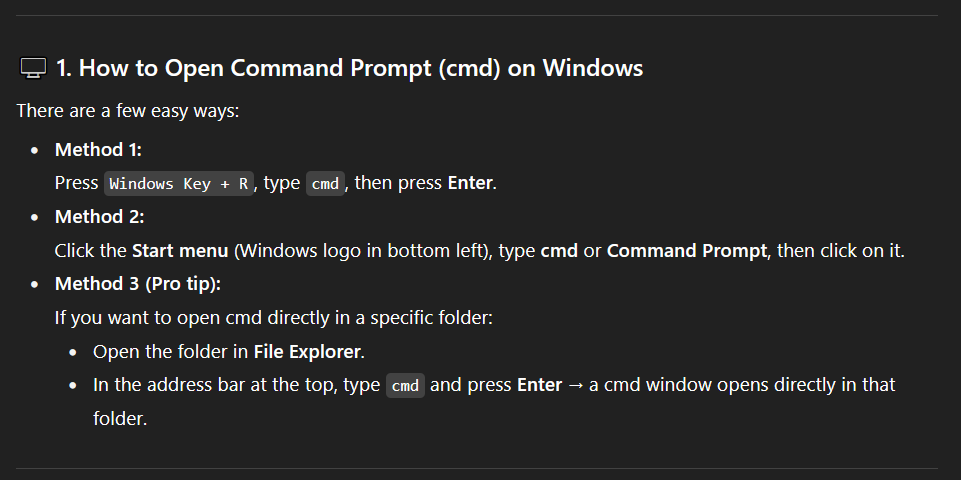
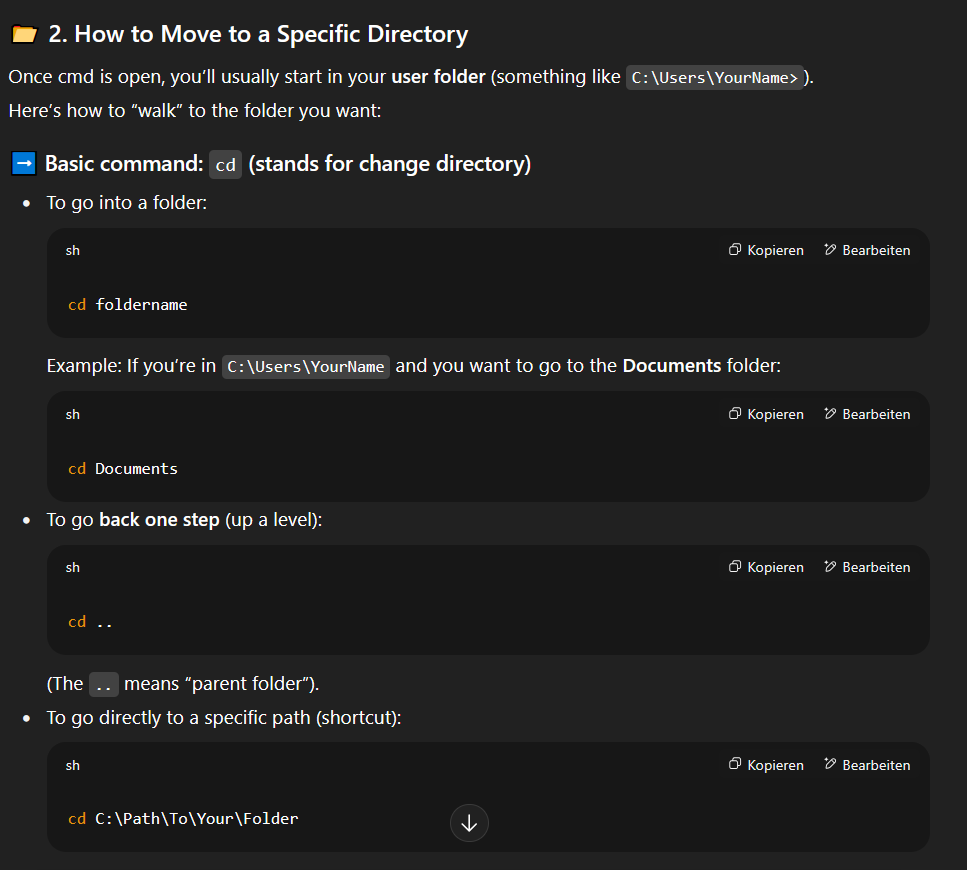
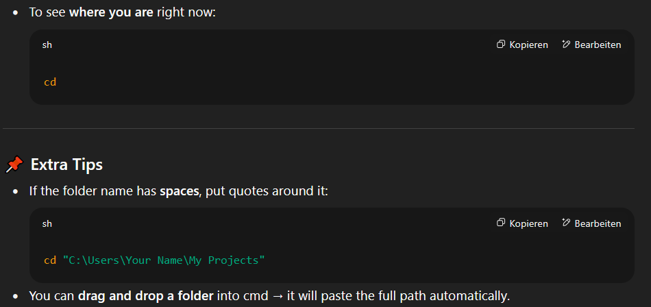

### Development Set Up

# Command prompt (cmd) Guide

# Set Up

Set up of the development environment for the future development of the Jupyter Notebooks.

To set up and acitvate the virtual environment for this project, follow these steps:

**Note: this guide is for Windows only**

# Install Python, npm and Node.js
1. Python:
- install from https://www.python.org/downloads/windows/
- run the installer and click "Add Python to PATH" when installing
- verify the installation by running the command `python --version` in your cmd (anywhere, directory doesnt matter)

2. Node.js and npm
- install the LTS version from https://nodejs.org/en
- run the installer and click “Automatically install the necessary tools”
- verify the installation via `node --version` and `npm --version` in cmd
- update npm with `npm install -g npm`

# Make virtual environment
Run these commands in your cmd in your project directory:

- `python -m venv venv`
- activate environment: `.\venv\Scripts\activate`
- install requirements inside venv: `pip install -r requirements.txt`
- install ipympl for matplotlib widgets: `pip install notebook ipympl matplotlib`
- activate pre commit hooks: `pre-commit install`
